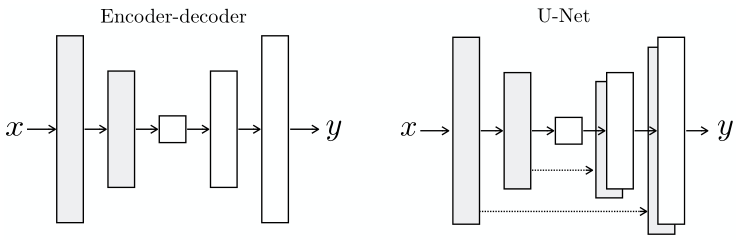

# Course 1:

## Writing maths in markdown

In the following example, we will write some maths in a markdown file.
And many things can be done with it.

$$
\begin{aligned}
    \frac{\partial L}{\partial \theta} &= \frac{\partial L}{\partial \hat{y}} \frac{\partial \hat{y}}{\partial \theta} \\
    &= \frac{\partial L}{\partial \hat{y}} (x_1 \sigma_1 + x_2 \sigma_2 + x_3 \sigma_3)
\end{aligned}
$$

## Embedding an image in a markdown file

In the following example, we will embed an image in a markdown file.

From an local image  

Frome an external source:

## Embedding a video in a markdown file

In the following example, we will embed a video in a markdown file.

<iframe width="560" height="315" src="https://www.youtube.com/embed/qs5VyYtlY8Y" title="YouTube video player" frameborder="0" allow="accelerometer; autoplay; clipboard-write; encrypted-media; gyroscope; picture-in-picture; web-share" allowfullscreen></iframe>

## Embedding a pdf in a markdown file

In the following example, we will embed a pdf file in a markdown file.   
This is useful for example to embed a pdf version of a presentation.

<object data="https://arxiv.org/pdf/2209.09203.pdf" width="1000" height="1000" type='application/pdf'></object>

